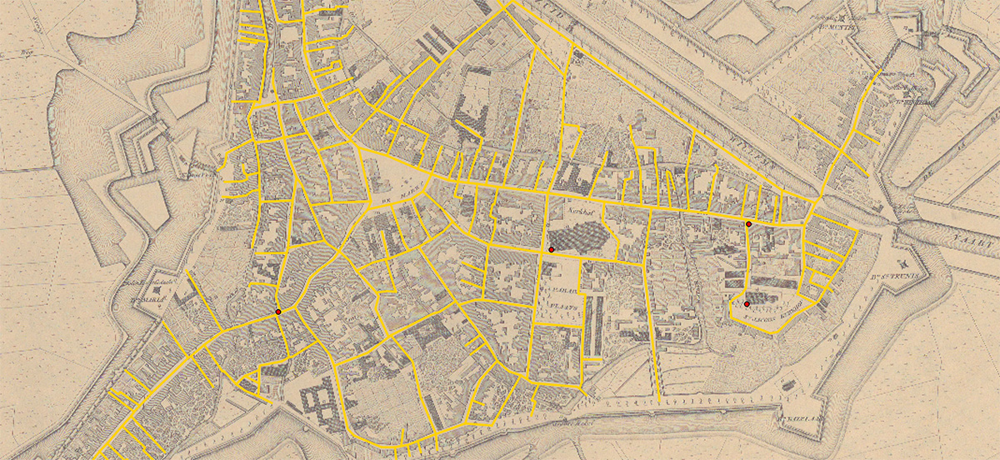

# Bronnen

## Kaart Drossaers / Veelwaard 1840-1860

De straatnamen zoals die voorkomen in de legenda van de kaart zijn gebruikt voor de [straatnamenlijst](schrijfwijzes/straatnamenlijst.csv).

De straten zijn ingetekend, zodat de lijngeometrieën (van straten die zijn verdwenen of van loop zijn veranderd) later gebruikt kunnen worden. De geometrieën zijn te vinden in het bestand [drossaersveelwaard.geojson](drossaersveelwaard.geojson)

De gebruikte kaart is afkomstig van [https://proxy.archieven.nl/235/896A40005F1A41FA88126A8BFCF946ED](https://proxy.archieven.nl/235/896A40005F1A41FA88126A8BFCF946ED) en daar ook te downloaden.

